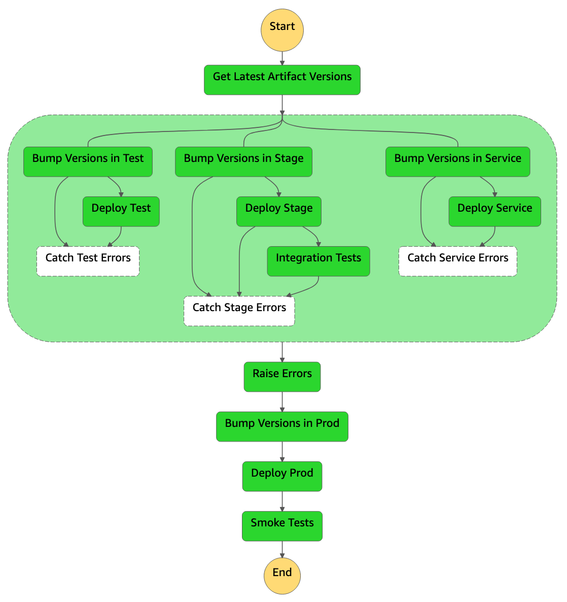

# aws-sfn-deployment-pipeline
This repository contains the full setup for a continuous deployment pipeline based on:
- **AWS** as cloud service provider
- **AWS Step Functions** for Continuous Deployment (CD)
- **Terraform** as Infrastructure as Code (IaC)
 


The pipeline will be set up to deploy to a _service_, _test_ and _stage_ account in parallel. If all of these steps successfully pass, the pipeline will finally deploy to the _prod_ account.

This repository uses Terraform as IaC, and a _deployment_ in this context then boils down to running `terraform init && terraform apply -auto-approve` inside the respective folders (e.g., `terraform/test`). This can, however, be adapted to other tooling and workflows, if needed.

## Prerequisites
There are a few prerequisites you need before getting started with the set up:
- Four AWS accounts: a _service_ account that hosts the CD pipeline and artifact stores, as well as a _test_, _stage_, and _prod_ account for hosting production/production-like environments. (*NOTE*: Only a single account is strictly required, but the [state machine definition](terraform/service/states.tf) must be adapted if you have less than four accounts).
- An encrypted S3 bucket in each account for storing Terraform state.
- A DynamoDB table in each account for locking the state files.

## Setup
1. Create S3 buckets and DynamoDB tables in each of your accounts. For uniqueness and consistency's sake, the setup expects these resources to be prefixed with the AWS account ID (e.g., `<account-id>-terraform-state` and `<account-id>-terraform-lock`). (**NOTE**: We have included a guide and CloudFormation template for easy provisioning of these resources in [cloudformation/](cloudformation/)).
2. Replace the placeholders in the repository by running the following command (replacing the options with your values):
  <details>
  <summary>Show option details and example values</summary>
  <p>
  <pre>
  <b>--project-name</b>
    The name of the current project.
    Example: <i>sfn-project</i>
  <b>--terraform-state-bucket-suffix</b>
    The suffix of the S3 bucket for storing the Terraform state.
    Example: <i>terraform-state</i>
  <b>--terraform-lock-table-suffix</b>
    The suffix of the DynamoDB table used by Terraform to lock state files.
    Example: <i>terraform-lock</i>
  <b>--service-account-id</b>
    The ID of the AWS service account.
  <b>--test-account-id</b>
    The ID of the AWS test account.
  <b>--stage-account-id</b>
    The ID of the AWS stage account.
  <b>--prod-account-id</b>
    The ID of the AWS prod account.
  </pre>
  </p>
  </details>
  
  ```bash
  $ ./replace_placeholders.sh \
      --project-name                   "<name>" \
      --service-account-id             "<account-id>" \
      --test-account-id                "<account-id>" \
      --stage-account-id               "<account-id>" \
      --prod-account-id                "<account-id>" \
      --terraform-state-bucket-suffix  "<suffix>" \
      --terraform-lock-table-suffix    "<suffix>"
  ```
3. Go to the root of the IaC for each account (i.e., `terraform/{service,test,stage,prod}`), log in to the corresponding account and run `terraform init` and `terraform apply` to bootstrap the setup.

## Usage
You can manually start the pipeline by creating a ZIP file of the contents of the current repository, storing it in the newly created artifact bucket in your _service_ account and starting a pipeline execution with an input:
```json
{
  "deployment_package": "s3://<service-account-id>-<project-name>-pipeline-artifact/<your-zip>.zip"
}
```

The AWS Step Functions will now deploy whatever ZIP file is input during execution under the key `deployment_package`.

## What's Next?
More examples, extensions and details surrounding Continuous Integration are available under [docs/](docs/).
