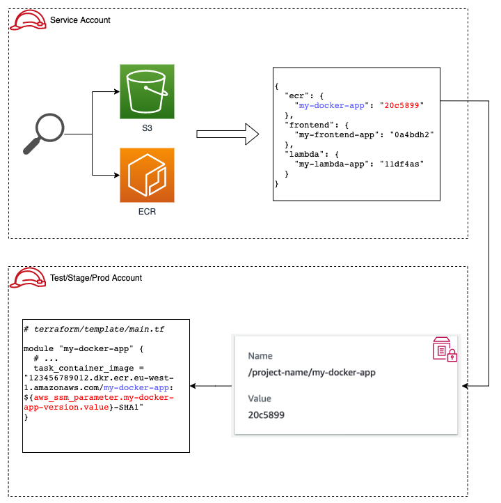

# Documentation
This folder contains various examples on how to add applications to the CI/CD pipeline, as well as various extensions.

## Deployment Model
### Application
In short, the deployment model for applications is based on:
1. Tagging artifacts -- Docker images and ZIP/JAR files -- with the originating git branch and commit hash.
2. Storing the latest artifact _version_ (i.e., latest artifact from master) for every artifact in a parameter in AWS Parameter Store in the test, stage and prod accounts.
3. Referencing the parameter in your IaC, such that any updates to the parameters will be picked up during a deployment.



The main functionality for this deployment model is performed during an execution of the AWS Step Functions state machine in the steps `Get Latest Artifact Versions` and `Bump Versions in <env>`.

### IaC
IaC, in our case Terraform, is deployed by:
1. Assuming a role in the correct account (e.g., _test_)
2. Unzipping the latest version of the git repository
3. Changing the directory to the correct account (e.g., `terraform/test`) 
4. Applying the IaC.

In short, this boils down to spinning up a container and running:
```sh
cd terraform/<env> && terraform init && terraform apply -auto-approve
```

## Continuous Integration
If you have successfully followed the guide in the main README, an IAM user with limited access to S3 and ECR will have been created in your _service_ account, with the credentials encrypted and stored in Parameter Store. These credentials can then be added to your CI service of choice to upload artifacts to S3 and ECR.

The initial setup will also provision an S3 bucket in your _service_ account for storing S3 artifacts. Source code is expected to be uploaded under a prefix using the following format `<github-owner>/<github-repo>/branches/<branch-name>/<sha1>.zip`. Your CI service can initiate a deployment by uploading the file `trigger-event.json` at the end of its workflow. This will trigger a Lambda function, which will read the contents of this file to determine which state machine to start with which input. Similar to the source code, the file is expected to be uploaded under the prefix `<github-owner>/<github-repo>/branches/<branch-name>/trigger-event.json`.

Here is an example `trigger-event.json`:
```json
{
  "pipeline_name": "example-state-machine",
  "git_owner": "stekern",
  "git_repo": "my-repo",
  "git_branch":"master",
  "git_sha1": "1234567"
}
```

If your CI service uploads this file to S3 under the key `example-bucket/stekern/my-repo/branches/master/trigger-event.json`, an AWS Step Functions execution of the state machine named *example-state-machine* will be started with an input that points to a specific ZIP file ` { "deployment_package": "s3://example-bucket/stekern/my-repo/branches/master/124567.zip" }`. This ZIP file will be mounted in all the `Deploy <env>` steps.

## Useful Modules
The following is a an overview over additional modules that can be used to further extend the setup.

### Slack Notifier
This Terraform module sets up an AWS Lambda function that will send messages to Slack when an AWS Step Functions pipeline starts, fails or ends.

The module can be used utilized by adding the following snippet to your _service_ account (i.e., `terraform/service/main.tf`):
```terraform
module "slack_notifier" {
  source         = "github.com/nsbno/terraform-stepfunction-status-slack?ref=5de7f6b"
  name_prefix    = local.name_prefix
  slackwebhook   = "<webhook-url>"
  tags           = local.tags
}
```

See module documentation for more details: https://github.com/nsbno/terraform-stepfunction-status-slack

### Metrics Collection
This Terraform module sets up an AWS Lambda function that periodically derives useful metrics (e.g., lead time, mean time to recovery) from the execution history of one or more AWS Step Functions pipelines and stores them as AWS CloudWatch Custom Metrics.

The module can be used utilized by adding the following snippet to your _service_ account (i.e., `terraform/service/main.tf`):
```terraform
module "metrics" {
  source             = "github.com/nsbno/terraform-aws-pipeline-metrics?ref=9370d33"
  name_prefix        = local.name_prefix
  state_machine_arns = [aws_sfn_state_machine.state_machine.id]
  tags               = local.tags
}
```

See module documentation for more details: https://github.com/nsbno/terraform-aws-pipeline-metrics

### Manual Approval Step
This Terraform module exposes an AWS Lambda function that can be used inside an AWS Step Functions pipeline to send a message to Slack and manually wait for an approval or rejection.

The module can be used by adding the following snippet to your _service_ account (i.e., `terraform/service/main.tf`):
```terraform
module "manual_approval" {
  source             = "github.com/nsbno/terraform-aws-pipeline-approver?ref=d1bd28d"
  name_prefix        = local.name_prefix
  slack_webhook_url  = "<webhook-url>"
  state_machine_arns = [aws_sfn_state_machine.state_machine.id]
  tags               = local.tags
}
```

See module documentation for more details: https://github.com/nsbno/terraform-aws-pipeline-approver.
